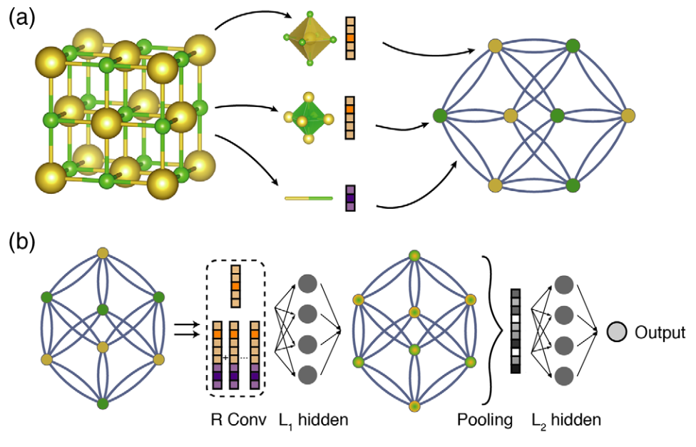

# CGCNN (Crystal Graph Convolutional Neural Networks for an Accurate and Interpretable Prediction of Material Properties)

开始训练、评估前，请先下载[数据集](https://cmr.fysik.dtu.dk/c2db/c2db.html)并进行划分。

=== "模型训练命令"

    ``` sh
    python /home/data_cy/PaddleScience/examples/cgcnn/CGCNN.py mode=train TRAIN_DIR="Your train dataset path"
    ```

=== "模型评估命令"

    ``` sh
    python /home/data_cy/PaddleScience/examples/cgcnn/CGCNN.py mode=eval EVAL.MODEL_PATH="Your pretrained model path" EVALUATE_DIR="Your evaluate dataset path"
    ```

## 1. 背景简介

机器学习方法在加速新材料设计方面变得越来越流行，其预测材料性质的精度接近于从头计算，但计算速度要快几个数量级。晶体系统的任意尺寸带来了挑战，因为它们需要表示为固定长度的向量，以便与大多数算法兼容。这个问题通常是通过使用简单的材料属性手动构造固定长度的特征向量或设计原子坐标的对称不变变换来解决的。然而，前者需要逐个设计来预测不同的性质，而后者由于复杂的变换使得模型难以解释。CGCNN是一个广义的晶体图卷积神经网络框架框架，用于表示周期性晶体系统，它既提供了具有密度泛函理论(DFT)精度的材料性质预测，又提供了原子水平的化学见解。因此本案例使用CGNN对二维半导体材料的能带性质进行预测。

## 2. 模型原理

本章节仅对 CGCNN 的模型原理进行简单地介绍，详细的理论推导请阅读 [Crystal Graph Convolutional Neural Networks for an Accurate and Interpretable Prediction of Material Properties](https://journals.aps.org/prl/abstract/10.1103/PhysRevLett.120.145301)。

该方法的主要思想是通过一个同时编码原子信息和原子间成键相互作用的晶体图来表示晶体结构，然后在该图上构建一个卷积神经网络，通过使用DFT计算数据进行训练，自动提取最适合预测目标性质的表示。如图所示，晶体图是一个无向多图，它由代表原子的节点和代表晶体中原子之间连接的边所定义。晶体图不同于普通图，因为它允许在同一对端点之间有多条边，这是晶体图的一个特点，同时因为它们的周期性，其与分子图也有所不同。图中每个节点由一个特征向量表示，编码节点对应原子的属性。类似地，每条边同样用特征向量表示；对应于连接原子的键。

模型的总体结构如图所示：

{style="margin:0 auto" }
*CGCNN 网络模型*

## 3 模型构建与训练

CGCNN 论文中预测了七种不同性质，接下来将介绍如何使用 PaddleScience 代码实现 CGCNN 网络预测二维半导体间隙性质

### 3.1 数据集介绍

CGCNN 原文中使用的是 数据集 (<https://next-gen.materialsproject.org/>) 和 数据集(<https://cmr.fysik.dtu.dk/cubic_perovskites/cubic_perovskites.html>)。本案例使用自行收集的数据集进行训练测试，如果用户需要使用本案例进行相关任务，可以参考以下数据集格式:

- [CIF](https://en.wikipedia.org/wiki/Crystallographic_Information_File) 用于记录用户所需的晶体结构的文件。
- [id _ prop.csv] 每个晶体的目标属性。

您可以通过创建一个目录`root_dir`来创建一个自定义数据集，该目录包含以下文件:

1. `id_prop.csv`: [CSV](https://en.wikipedia.org/wiki/Comma-separated_values) 第一列为每个晶体重新编码一个唯一的`ID`，第二列重新编码目标属性的值。

2. `atom_init.json`: [JSON](https://en.wikipedia.org/wiki/JSON) 存储每个元素的初始向量。

3. `ID.cif`: [CIF](https://en.wikipedia.org/wiki/Crystallographic_Information_File) 对晶体结构进行重新编码的文件，其中`ID`是晶体在数据集中的唯一ID。

`root_dir`的结构应该是(`root_dir`泛指训练/评估/测试数据文件夹):

```
root_dir
├── id_prop.csv
├── atom_init.json
├── id0.cif
├── id1.cif
├── ...
```

### 3.2 模型构建

CGCNN 需要通过所使用的数据进行模型构造，因此需要先实例化`CGCNNDataset` 。在实例化`CGCNNDataset`后可以得到训练样本的长度和输入维度等信息，根据此信息和设定的模型超参数`cfg.MODEL.ATOM_FEA_LEN`、`cfg.MODEL.N_CONV`、`cfg.MODEL.H_FEA_LEN`、`cfg.MODEL.N_H`完成`CrystalGraphConvNet`的实例化。

``` py linenums="68" title="PaddleScience/examples/cgcnn/CGCNN.py"
# build model
dataset = CGCNNDataset(cfg.TRAIN_DIR, input_keys='i',label_keys='l',id_keys='c')
structures, _, _ = dataset.raw_data[0]
orig_atom_fea_len = structures[0].shape[-1]
nbr_fea_len = structures[1].shape[-1]
model = CrystalGraphConvNet(orig_atom_fea_len, nbr_fea_len,
                            atom_fea_len=cfg.MODEL.ATOM_FEA_LEN,
                            n_conv=cfg.MODEL.N_CONV,
                            h_fea_len=cfg.MODEL.H_FEA_LEN,
                            n_h=cfg.MODEL.N_H)
```

其中超参数`cfg.MODEL.ATOM_FEA_LEN`、`cfg.MODEL.N_CONV`、`cfg.MODEL.H_FEA_LEN`、`cfg.MODEL.N_H`默认设定如下：

``` yaml linenums="35" title="PaddleScience/examples/cgcnn/conf/CGCNN_Demo.yaml"
# model settings
MODEL: # 
  ATOM_FEA_LEN: 64 # 
  N_CONV: 3 # 
  H_FEA_LEN: 128 # 
  N_H: 1 # 
```

### 3.3 优化器构建

训练时使用`SGD`优化器进行训练，相关代码如下：
``` py linenums="124" title="PaddleScience/examples/cgcnn/CGCNN.py"
# Learning rate scheduler
optimizer = optim.Momentum(learning_rate=cfg.TRAIN.lr, momentum=cfg.TRAIN.momentum,
                            weight_decay=cfg.TRAIN.weight_decay)(model)
```

训练超参数`cfg.TRAIN.lr`、`cfg.TRAIN.momentum`、`cfg.TRAIN.weight_decay`等默认设定如下：
``` yaml linenums="42" title="PaddleScience/examples/cgcnn/conf/CGCNN_Demo.yaml"
# training settings
TRAIN: # 
  epochs: 30 # 
  eval_during_train: true # 
  eval_freq: 1 # 
  batch_size: 64 # 
  lr: 0.001 # 
  momentum: 0.9 #
  weight_decay: 0.01 #
  pretrained_model_path: null # 
  checkpoint_path: null # 
```

### 3.4 约束构建

本问题模型为回归模型，因此采用监督学习方式进行训练，因此可以使用PaddleScience内置监督约束`SupervisedConstraint`构建监督约束。代码如下：

``` py linenums="78" title="PaddleScience/examples/cgcnn/CGCNN.py"
cgcnn_constraint = ppsci.constraint.SupervisedConstraint(
    dataloader_cfg={
        "sampler": {
            "name": "BatchSampler"
        },
        "dataset": {
            "name": "CGCNNDataset",
            "root_dir": cfg.TRAIN_DIR,
            "input_keys": 'i',
            "label_keys": 'l',
            "id_keys": 'c'
        },
        "batch_size": cfg.TRAIN.batch_size,         
        "collate_fn": collate_pool},
        loss=ppsci.loss.MAELoss('mean'),
        output_expr= {"l": lambda out: out["out"]},
        name='cgcnn_constraint',
    )
    
constraint = {cgcnn_constraint.name: cgcnn_constraint}
```

其中`root_dir`为训练集路径，`batch_size`为批训练大小。为了能够正常的批次训练，`collate_fn`需要根据模型进行重新设计。`collate_pool`代码如下：

``` py linenums="17" title="PaddleScience/ppsci/data/dataset/cgcnn_dataset.py"
def collate_pool(dataset_list):
 
    batch_atom_fea, batch_nbr_fea, batch_nbr_fea_idx = [], [], []
    crystal_atom_idx, batch_target = [], []
    batch_cif_ids = []
    base_idx = 0

    for i, item in enumerate(dataset_list):
        input = item[0]['i']
        label = item[1]['l']
        id  =item[2]['c']
        atom_fea, nbr_fea, nbr_fea_idx = input
        target = label
        cif_id = id
        n_i = atom_fea.shape[0]  
        batch_atom_fea.append(atom_fea)
        batch_nbr_fea.append(nbr_fea)
        batch_nbr_fea_idx.append(nbr_fea_idx + base_idx)
        new_idx = paddle.to_tensor(np.arange(n_i) + int(base_idx), dtype='int64')
        crystal_atom_idx.append(new_idx)
        batch_target.append(target)
        batch_cif_ids.append(cif_id)
        base_idx += n_i

    batch_atom_fea = paddle.concat(batch_atom_fea, axis=0)
    batch_nbr_fea = paddle.concat(batch_nbr_fea, axis=0)
    batch_nbr_fea_idx = paddle.concat(batch_nbr_fea_idx, axis=0)
  
    return {'i':(paddle.to_tensor(batch_atom_fea, dtype='float32'),
                 paddle.to_tensor(batch_nbr_fea, dtype='float32'),
                 paddle.to_tensor(batch_nbr_fea_idx), 
                 [paddle.to_tensor(crys_idx) for crys_idx in crystal_atom_idx])},\
           {'l':paddle.to_tensor(paddle.stack(batch_target, axis=0))}, \
           {'c':batch_cif_ids}
```

### 3.5 评估器构建

为了实时监测模型的训练情况，我们将在每轮训练后对上一轮训练完毕的模型进行评估。与训练过程保持一致，我们使用PaddleScience内置的`SupervisedValidator`函数构建监督数据评估器。具体代码如下：

``` py linenums="101" title="PaddleScience/examples/cgcnn/CGCNN.py"
cgcnn_valid = ppsci.validate.SupervisedValidator(
    dataloader_cfg={
      "sampler": {
      "name": "BatchSampler"},
      "dataset": {
            "name": "CGCNNDataset",
            "root_dir": cfg.VALID_DIR,
            "input_keys": 'i',
            "label_keys": 'l',
            "id_keys": 'c'},
      "batch_size": cfg.TRAIN.batch_size,         
      "collate_fn": collate_pool},
      loss=ppsci.loss.MAELoss('mean'),
      output_expr= {"l": lambda out: out["out"]},
      metric={"MAE":ppsci.metric.MAE()},
      name="cgcnn_valid",
    )
validator = {cgcnn_valid.name: cgcnn_valid}
```

### 3.6 模型训练
由于本问题被建模为回归问题，因此可以使用PaddleScience内置的`psci.loss.MAELoss('mean')`作为训练过程的损失函数。同时选择使用随机梯度下降法对网络进行优化。并且将训练过程封装至PaddleScience内置的`Solver`中，具体代码如下：
``` py linenums="124" title="PaddleScience/examples/cgcnn/CGCNN.py"
# Learning rate scheduler
optimizer = optim.Momentum(learning_rate=cfg.TRAIN.lr, momentum=cfg.TRAIN.momentum,
                                   weight_decay=cfg.TRAIN.weight_decay)(model)


solver = ppsci.solver.Solver(
        model=model,
        constraint=constraint,
        optimizer=optimizer,
        epochs=cfg.TRAIN.epochs,
        eval_during_train=True,
        validator=validator,
        equation=None,
        output_dir=cfg.output_dir,
        cfg=cfg
    )
# train model
solver.train()
    
# evaluate model
solver.eval()
```


## 4. 完整代码

``` py linenums="1" title="PaddleScience/examples/cgcnn/CGCNN.py"
from os import path as osp
from omegaconf import DictConfig
import paddle
import ppsci
import ppsci.constraint.supervised_constraint
import warnings
import numpy as np
warnings.filterwarnings('ignore')
import ppsci.optimizer as optim
from ppsci.data.dataset import CGCNNDataset
from ppsci.data.dataset.cgcnn_dataset import collate_pool
from ppsci.arch import CrystalGraphConvNet
import hydra
paddle.device.set_device('cpu')

def evaluate(cfg:DictConfig):
    # load data
    dataset = CGCNNDataset(cfg.EVALUATE_DIR,input_keys='i',label_keys='l',id_keys='c')

    # build model
    structures, _, _ = dataset.raw_data[0]
    orig_atom_fea_len = structures[0].shape[-1]
    nbr_fea_len = structures[1].shape[-1]
    model = CrystalGraphConvNet(orig_atom_fea_len, nbr_fea_len,
                                atom_fea_len=cfg.MODEL.ATOM_FEA_LEN,
                                n_conv=cfg.MODEL.N_CONV,
                                h_fea_len=cfg.MODEL.H_FEA_LEN,
                                n_h=cfg.MODEL.N_H)
        
    cgcnn_evaluate = ppsci.validate.SupervisedValidator(
        dataloader_cfg={
        "sampler": {
            "name": "BatchSampler"
        },
        
        "dataset": {
            "name": "CGCNNDataset",
            "root_dir": cfg.EVALUATE_DIR,
            "input_keys": 'i',
            "label_keys": 'l',
            "id_keys": 'c'
        },
        
        "batch_size": cfg.EVAL.batch_size,         
        "collate_fn": collate_pool},
        loss=ppsci.loss.MAELoss('mean'),
        output_expr= {"l": lambda out: out["out"]},
        metric={"MAE":ppsci.metric.MAE()},
        name="cgcnn_evaluate",
    )
    validator = {cgcnn_evaluate.name: cgcnn_evaluate}
    solver = ppsci.solver.Solver(
        model,
        validator=validator,
        pretrained_model_path=cfg.EVAL.MODEL_PATH,
        cfg=cfg
    )
    
    solver.eval()

def train(cfg:DictConfig):

    # load data
    dataset = CGCNNDataset(cfg.TRAIN_DIR, input_keys='i',label_keys='l',id_keys='c')

    # build model
    structures, _, _ = dataset.raw_data[0]
    orig_atom_fea_len = structures[0].shape[-1]
    nbr_fea_len = structures[1].shape[-1]
    model = CrystalGraphConvNet(orig_atom_fea_len, nbr_fea_len,
                                atom_fea_len=cfg.MODEL.ATOM_FEA_LEN,
                                n_conv=cfg.MODEL.N_CONV,
                                h_fea_len=cfg.MODEL.H_FEA_LEN,
                                n_h=cfg.MODEL.N_H)
    
    cgcnn_constraint = ppsci.constraint.SupervisedConstraint(
        dataloader_cfg={
        "sampler": {
            "name": "BatchSampler"
        },
        
        "dataset": {
            "name": "CGCNNDataset",
            "root_dir": cfg.TRAIN_DIR,
            "input_keys": 'i',
            "label_keys": 'l',
            "id_keys": 'c'
        },
        
        "batch_size": cfg.TRAIN.batch_size,         
        "collate_fn": collate_pool},
        loss=ppsci.loss.MAELoss('mean'),
        output_expr= {"l": lambda out: out["out"]},
        name='cgcnn_constraint',
    )
    
    constraint = {cgcnn_constraint.name: cgcnn_constraint}
    
    cgcnn_valid = ppsci.validate.SupervisedValidator(
        dataloader_cfg={
        "sampler": {
            "name": "BatchSampler"
        },
        
        "dataset": {
            "name": "CGCNNDataset",
            "root_dir": cfg.VALID_DIR,
            "input_keys": 'i',
            "label_keys": 'l',
            "id_keys": 'c'
        },
        
        "batch_size": cfg.TRAIN.batch_size,         
        "collate_fn": collate_pool},
        loss=ppsci.loss.MAELoss('mean'),
        output_expr= {"l": lambda out: out["out"]},
        metric={"MAE":ppsci.metric.MAE()},
        name="cgcnn_valid",
    )
    validator = {cgcnn_valid.name: cgcnn_valid}

    # Learning rate scheduler
    optimizer = optim.Momentum(learning_rate=cfg.TRAIN.lr, momentum=cfg.TRAIN.momentum,
                                   weight_decay=cfg.TRAIN.weight_decay)(model)


    solver = ppsci.solver.Solver(
        model=model,
        constraint=constraint,
        optimizer=optimizer,
        epochs=cfg.TRAIN.epochs,
        eval_during_train=True,
        validator=validator,
        equation=None,
        output_dir=cfg.output_dir,
        cfg=cfg
    )

    # train model
    solver.train()
    
    # evaluate model
    solver.eval()
    
@hydra.main(version_base=None, config_path="./conf", config_name="CGCNN_Demo.yaml")
def main(cfg:DictConfig):
    if cfg.mode == 'train':
        train(cfg)
    elif cfg.mode == 'eval':
        evaluate(cfg)
    else:
        raise ValueError(
            f"cfg.mode should in ['train', 'eval'], but got '{cfg.mode}'")
            
if __name__ == '__main__':
   main()

```

## 5. 实验结果示例
```
[2024/07/30 14:40:30] ppsci WARNING: Set device(gpu) to 'cpu' for only cpu available.
[2024/07/30 14:40:30] ppsci INFO: Using paddlepaddle 3.0.0 on device Place(cpu)
[2024/07/30 14:40:30] ppsci MESSAGE: Set to_static=False for computational optimization.
[2024/07/30 14:40:31] ppsci INFO: [Train][Epoch  1/30][Iter  1/20] lr: 0.00100, loss: 3.57476, cgcnn_constraint: 3.57476, batch_cost: 0.38202s, reader_cost: 0.00218s, ips: 240.82, eta: 0:03:48
[2024/07/30 14:40:35] ppsci INFO: [Train][Epoch  1/30][Iter 20/20] lr: 0.00100, loss: 1.65848, cgcnn_constraint: 1.65848, batch_cost: 0.23987s, reader_cost: 0.00041s, ips: 383.53, eta: 0:02:19
[2024/07/30 14:40:36] ppsci INFO: [Eval][Epoch  1/30][Iter 1/8] cgcnn_valid/loss: 1.43053, batch_cost: 0.18432s, reader_cost: 0.05963s, ips: 499.13, eta: 0:00:01
[2024/07/30 14:40:36] ppsci INFO: [Eval][Epoch  1/30][Iter 8/8] cgcnn_valid/loss: 1.46986, batch_cost: 0.08287s, reader_cost: 0.00028s, ips: 1110.21, eta: 0:00:00
[2024/07/30 14:40:36] ppsci INFO: [Eval][Epoch 1][Avg] cgcnn_valid/loss: 1.46986, cgcnn_valid/MAE.l: 1.47363
[2024/07/30 14:40:36] ppsci MESSAGE: Finish saving checkpoint to: outputs_CGCNN/2024-07-30/14-38-40/checkpoints/best_model
[2024/07/30 14:40:36] ppsci INFO: [Eval][Epoch 1][best metric: 1.4736334085464478]
[2024/07/30 14:40:36] ppsci MESSAGE: Finish saving checkpoint to: outputs_CGCNN/2024-07-30/14-38-40/checkpoints/latest(latest checkpoint will be saved every epoch as expected, but this log will be printed only once for tidy logging)
[2024/07/30 14:40:41] ppsci INFO: [Train][Epoch  2/30][Iter 20/20] lr: 0.00100, loss: 1.05329, cgcnn_constraint: 1.05329, batch_cost: 0.24024s, reader_cost: 0.00040s, ips: 382.95, eta: 0:02:14
[2024/07/30 14:40:41] ppsci INFO: [Eval][Epoch  2/30][Iter 1/8] cgcnn_valid/loss: 1.05451, batch_cost: 0.10415s, reader_cost: 0.01363s, ips: 883.35, eta: 0:00:00
[2024/07/30 14:40:42] ppsci INFO: [Eval][Epoch  2/30][Iter 8/8] cgcnn_valid/loss: 1.02158, batch_cost: 0.08726s, reader_cost: 0.00030s, ips: 1054.37, eta: 0:00:00
[2024/07/30 14:40:42] ppsci INFO: [Eval][Epoch 2][Avg] cgcnn_valid/loss: 1.02158, cgcnn_valid/MAE.l: 1.01304
[2024/07/30 14:40:42] ppsci MESSAGE: Finish saving checkpoint to: outputs_CGCNN/2024-07-30/14-38-40/checkpoints/best_model
[2024/07/30 14:40:42] ppsci INFO: [Eval][Epoch 2][best metric: 1.0130445957183838]
[2024/07/30 14:40:46] ppsci INFO: [Train][Epoch  3/30][Iter 20/20] lr: 0.00100, loss: 0.84313, cgcnn_constraint: 0.84313, batch_cost: 0.22372s, reader_cost: 0.00039s, ips: 411.24, eta: 0:02:00
[2024/07/30 14:40:47] ppsci INFO: [Eval][Epoch  3/30][Iter 1/8] cgcnn_valid/loss: 0.83270, batch_cost: 0.10797s, reader_cost: 0.01216s, ips: 852.08, eta: 0:00:00
[2024/07/30 14:40:47] ppsci INFO: [Eval][Epoch  3/30][Iter 8/8] cgcnn_valid/loss: 0.78863, batch_cost: 0.08373s, reader_cost: 0.00029s, ips: 1098.79, eta: 0:00:00
[2024/07/30 14:40:47] ppsci INFO: [Eval][Epoch 3][Avg] cgcnn_valid/loss: 0.78863, cgcnn_valid/MAE.l: 0.78113
[2024/07/30 14:40:47] ppsci MESSAGE: Finish saving checkpoint to: outputs_CGCNN/2024-07-30/14-38-40/checkpoints/best_model
[2024/07/30 14:40:47] ppsci INFO: [Eval][Epoch 3][best metric: 0.7811285257339478]
[2024/07/30 14:40:52] ppsci INFO: [Train][Epoch  4/30][Iter 20/20] lr: 0.00100, loss: 0.65674, cgcnn_constraint: 0.65674, batch_cost: 0.24301s, reader_cost: 0.00753s, ips: 378.59, eta: 0:02:06
[2024/07/30 14:40:53] ppsci INFO: [Eval][Epoch  4/30][Iter 1/8] cgcnn_valid/loss: 0.74597, batch_cost: 0.10663s, reader_cost: 0.01334s, ips: 862.78, eta: 0:00:00
[2024/07/30 14:40:53] ppsci INFO: [Eval][Epoch  4/30][Iter 8/8] cgcnn_valid/loss: 0.72642, batch_cost: 0.08287s, reader_cost: 0.00030s, ips: 1110.19, eta: 0:00:00
[2024/07/30 14:40:53] ppsci INFO: [Eval][Epoch 4][Avg] cgcnn_valid/loss: 0.72642, cgcnn_valid/MAE.l: 0.72291
[2024/07/30 14:40:53] ppsci MESSAGE: Finish saving checkpoint to: outputs_CGCNN/2024-07-30/14-38-40/checkpoints/best_model
[2024/07/30 14:40:53] ppsci INFO: [Eval][Epoch 4][best metric: 0.7229076027870178]
[2024/07/30 14:40:58] ppsci INFO: [Train][Epoch  5/30][Iter 20/20] lr: 0.00100, loss: 0.67174, cgcnn_constraint: 0.67174, batch_cost: 0.23936s, reader_cost: 0.00042s, ips: 384.36, eta: 0:01:59
[2024/07/30 14:40:58] ppsci INFO: [Eval][Epoch  5/30][Iter 1/8] cgcnn_valid/loss: 0.69071, batch_cost: 0.10527s, reader_cost: 0.01320s, ips: 873.95, eta: 0:00:00
[2024/07/30 14:40:59] ppsci INFO: [Eval][Epoch  5/30][Iter 8/8] cgcnn_valid/loss: 0.67129, batch_cost: 0.08320s, reader_cost: 0.00029s, ips: 1105.82, eta: 0:00:00
[2024/07/30 14:40:59] ppsci INFO: [Eval][Epoch 5][Avg] cgcnn_valid/loss: 0.67129, cgcnn_valid/MAE.l: 0.66711
[2024/07/30 14:40:59] ppsci MESSAGE: Finish saving checkpoint to: outputs_CGCNN/2024-07-30/14-38-40/checkpoints/best_model
[2024/07/30 14:40:59] ppsci INFO: [Eval][Epoch 5][best metric: 0.6671075820922852]
[2024/07/30 14:41:04] ppsci INFO: [Train][Epoch  6/30][Iter 20/20] lr: 0.00100, loss: 0.63418, cgcnn_constraint: 0.63418, batch_cost: 0.23122s, reader_cost: 0.00039s, ips: 397.89, eta: 0:01:50
[2024/07/30 14:41:04] ppsci INFO: [Eval][Epoch  6/30][Iter 1/8] cgcnn_valid/loss: 0.64616, batch_cost: 0.10645s, reader_cost: 0.01410s, ips: 864.27, eta: 0:00:00
[2024/07/30 14:41:04] ppsci INFO: [Eval][Epoch  6/30][Iter 8/8] cgcnn_valid/loss: 0.63620, batch_cost: 0.08441s, reader_cost: 0.00029s, ips: 1089.92, eta: 0:00:00
[2024/07/30 14:41:05] ppsci INFO: [Eval][Epoch 6][Avg] cgcnn_valid/loss: 0.63620, cgcnn_valid/MAE.l: 0.63218
[2024/07/30 14:41:05] ppsci MESSAGE: Finish saving checkpoint to: outputs_CGCNN/2024-07-30/14-38-40/checkpoints/best_model
[2024/07/30 14:41:05] ppsci INFO: [Eval][Epoch 6][best metric: 0.6321775317192078]
[2024/07/30 14:41:09] ppsci INFO: [Train][Epoch  7/30][Iter 20/20] lr: 0.00100, loss: 0.57518, cgcnn_constraint: 0.57518, batch_cost: 0.23971s, reader_cost: 0.00767s, ips: 383.79, eta: 0:01:50
[2024/07/30 14:41:10] ppsci INFO: [Eval][Epoch  7/30][Iter 1/8] cgcnn_valid/loss: 0.61460, batch_cost: 0.10607s, reader_cost: 0.01325s, ips: 867.34, eta: 0:00:00
[2024/07/30 14:41:10] ppsci INFO: [Eval][Epoch  7/30][Iter 8/8] cgcnn_valid/loss: 0.58015, batch_cost: 0.08253s, reader_cost: 0.00029s, ips: 1114.72, eta: 0:00:00
[2024/07/30 14:41:10] ppsci INFO: [Eval][Epoch 7][Avg] cgcnn_valid/loss: 0.58015, cgcnn_valid/MAE.l: 0.57132
[2024/07/30 14:41:10] ppsci MESSAGE: Finish saving checkpoint to: outputs_CGCNN/2024-07-30/14-38-40/checkpoints/best_model
[2024/07/30 14:41:10] ppsci INFO: [Eval][Epoch 7][best metric: 0.5713244676589966]
[2024/07/30 14:41:15] ppsci INFO: [Train][Epoch  8/30][Iter 20/20] lr: 0.00100, loss: 0.58545, cgcnn_constraint: 0.58545, batch_cost: 0.23103s, reader_cost: 0.00040s, ips: 398.21, eta: 0:01:41
[2024/07/30 14:41:15] ppsci INFO: [Eval][Epoch  8/30][Iter 1/8] cgcnn_valid/loss: 0.57926, batch_cost: 0.10603s, reader_cost: 0.01421s, ips: 867.70, eta: 0:00:00
[2024/07/30 14:41:16] ppsci INFO: [Eval][Epoch  8/30][Iter 8/8] cgcnn_valid/loss: 0.55336, batch_cost: 0.08407s, reader_cost: 0.00029s, ips: 1094.30, eta: 0:00:00
[2024/07/30 14:41:16] ppsci INFO: [Eval][Epoch 8][Avg] cgcnn_valid/loss: 0.55336, cgcnn_valid/MAE.l: 0.54857
[2024/07/30 14:41:16] ppsci MESSAGE: Finish saving checkpoint to: outputs_CGCNN/2024-07-30/14-38-40/checkpoints/best_model
[2024/07/30 14:41:16] ppsci INFO: [Eval][Epoch 8][best metric: 0.5485656261444092]
[2024/07/30 14:41:20] ppsci INFO: [Train][Epoch  9/30][Iter 20/20] lr: 0.00100, loss: 0.57038, cgcnn_constraint: 0.57038, batch_cost: 0.22897s, reader_cost: 0.00041s, ips: 401.81, eta: 0:01:36
[2024/07/30 14:41:21] ppsci INFO: [Eval][Epoch  9/30][Iter 1/8] cgcnn_valid/loss: 0.60631, batch_cost: 0.11015s, reader_cost: 0.01389s, ips: 835.23, eta: 0:00:00
[2024/07/30 14:41:21] ppsci INFO: [Eval][Epoch  9/30][Iter 8/8] cgcnn_valid/loss: 0.58673, batch_cost: 0.08379s, reader_cost: 0.00030s, ips: 1097.99, eta: 0:00:00
[2024/07/30 14:41:21] ppsci INFO: [Eval][Epoch 9][Avg] cgcnn_valid/loss: 0.58673, cgcnn_valid/MAE.l: 0.58210
[2024/07/30 14:41:21] ppsci INFO: [Eval][Epoch 9][best metric: 0.5485656261444092]
[2024/07/30 14:41:26] ppsci INFO: [Train][Epoch 10/30][Iter 20/20] lr: 0.00100, loss: 0.54973, cgcnn_constraint: 0.54973, batch_cost: 0.24073s, reader_cost: 0.00828s, ips: 382.17, eta: 0:01:36
[2024/07/30 14:41:26] ppsci INFO: [Eval][Epoch 10/30][Iter 1/8] cgcnn_valid/loss: 0.57106, batch_cost: 0.10629s, reader_cost: 0.01405s, ips: 865.59, eta: 0:00:00
[2024/07/30 14:41:27] ppsci INFO: [Eval][Epoch 10/30][Iter 8/8] cgcnn_valid/loss: 0.53215, batch_cost: 0.08959s, reader_cost: 0.00029s, ips: 1026.87, eta: 0:00:00
[2024/07/30 14:41:27] ppsci INFO: [Eval][Epoch 10][Avg] cgcnn_valid/loss: 0.53215, cgcnn_valid/MAE.l: 0.52155
[2024/07/30 14:41:27] ppsci MESSAGE: Finish saving checkpoint to: outputs_CGCNN/2024-07-30/14-38-40/checkpoints/best_model
[2024/07/30 14:41:27] ppsci INFO: [Eval][Epoch 10][best metric: 0.521547257900238]
[2024/07/30 14:41:32] ppsci INFO: [Train][Epoch 11/30][Iter 20/20] lr: 0.00100, loss: 0.54075, cgcnn_constraint: 0.54075, batch_cost: 0.23733s, reader_cost: 0.00043s, ips: 387.65, eta: 0:01:30
[2024/07/30 14:41:32] ppsci INFO: [Eval][Epoch 11/30][Iter 1/8] cgcnn_valid/loss: 0.56064, batch_cost: 0.11273s, reader_cost: 0.01527s, ips: 816.14, eta: 0:00:00
[2024/07/30 14:41:33] ppsci INFO: [Eval][Epoch 11/30][Iter 8/8] cgcnn_valid/loss: 0.51424, batch_cost: 0.08257s, reader_cost: 0.00029s, ips: 1114.16, eta: 0:00:00
[2024/07/30 14:41:33] ppsci INFO: [Eval][Epoch 11][Avg] cgcnn_valid/loss: 0.51424, cgcnn_valid/MAE.l: 0.50397
[2024/07/30 14:41:33] ppsci MESSAGE: Finish saving checkpoint to: outputs_CGCNN/2024-07-30/14-38-40/checkpoints/best_model
[2024/07/30 14:41:33] ppsci INFO: [Eval][Epoch 11][best metric: 0.5039708018302917]
[2024/07/30 14:41:37] ppsci INFO: [Train][Epoch 12/30][Iter 20/20] lr: 0.00100, loss: 0.54631, cgcnn_constraint: 0.54631, batch_cost: 0.22423s, reader_cost: 0.00041s, ips: 410.29, eta: 0:01:20
[2024/07/30 14:41:38] ppsci INFO: [Eval][Epoch 12/30][Iter 1/8] cgcnn_valid/loss: 0.67826, batch_cost: 0.10521s, reader_cost: 0.01366s, ips: 874.41, eta: 0:00:00
[2024/07/30 14:41:38] ppsci INFO: [Eval][Epoch 12/30][Iter 8/8] cgcnn_valid/loss: 0.67416, batch_cost: 0.08641s, reader_cost: 0.00030s, ips: 1064.71, eta: 0:00:00
[2024/07/30 14:41:38] ppsci INFO: [Eval][Epoch 12][Avg] cgcnn_valid/loss: 0.67416, cgcnn_valid/MAE.l: 0.66721
[2024/07/30 14:41:38] ppsci INFO: [Eval][Epoch 12][best metric: 0.5039708018302917]
[2024/07/30 14:41:43] ppsci INFO: [Train][Epoch 13/30][Iter 20/20] lr: 0.00100, loss: 0.52614, cgcnn_constraint: 0.52614, batch_cost: 0.24001s, reader_cost: 0.00767s, ips: 383.32, eta: 0:01:21
[2024/07/30 14:41:43] ppsci INFO: [Eval][Epoch 13/30][Iter 1/8] cgcnn_valid/loss: 0.54794, batch_cost: 0.10906s, reader_cost: 0.01338s, ips: 843.54, eta: 0:00:00
[2024/07/30 14:41:44] ppsci INFO: [Eval][Epoch 13/30][Iter 8/8] cgcnn_valid/loss: 0.49780, batch_cost: 0.08299s, reader_cost: 0.00028s, ips: 1108.56, eta: 0:00:00
[2024/07/30 14:41:44] ppsci INFO: [Eval][Epoch 13][Avg] cgcnn_valid/loss: 0.49780, cgcnn_valid/MAE.l: 0.48350
[2024/07/30 14:41:44] ppsci MESSAGE: Finish saving checkpoint to: outputs_CGCNN/2024-07-30/14-38-40/checkpoints/best_model
[2024/07/30 14:41:44] ppsci INFO: [Eval][Epoch 13][best metric: 0.48349955677986145]
[2024/07/30 14:41:49] ppsci INFO: [Train][Epoch 14/30][Iter 20/20] lr: 0.00100, loss: 0.51895, cgcnn_constraint: 0.51895, batch_cost: 0.23631s, reader_cost: 0.00040s, ips: 389.33, eta: 0:01:15
[2024/07/30 14:41:49] ppsci INFO: [Eval][Epoch 14/30][Iter 1/8] cgcnn_valid/loss: 0.54861, batch_cost: 0.10677s, reader_cost: 0.01377s, ips: 861.63, eta: 0:00:00
[2024/07/30 14:41:50] ppsci INFO: [Eval][Epoch 14/30][Iter 8/8] cgcnn_valid/loss: 0.49685, batch_cost: 0.08855s, reader_cost: 0.00029s, ips: 1038.94, eta: 0:00:00
[2024/07/30 14:41:50] ppsci INFO: [Eval][Epoch 14][Avg] cgcnn_valid/loss: 0.49685, cgcnn_valid/MAE.l: 0.48367
[2024/07/30 14:41:50] ppsci INFO: [Eval][Epoch 14][best metric: 0.48349955677986145]
[2024/07/30 14:41:54] ppsci INFO: [Train][Epoch 15/30][Iter 20/20] lr: 0.00100, loss: 0.48818, cgcnn_constraint: 0.48818, batch_cost: 0.22576s, reader_cost: 0.00040s, ips: 407.51, eta: 0:01:07
[2024/07/30 14:41:55] ppsci INFO: [Eval][Epoch 15/30][Iter 1/8] cgcnn_valid/loss: 0.56888, batch_cost: 0.11100s, reader_cost: 0.01292s, ips: 828.81, eta: 0:00:00
[2024/07/30 14:41:55] ppsci INFO: [Eval][Epoch 15/30][Iter 8/8] cgcnn_valid/loss: 0.54621, batch_cost: 0.08477s, reader_cost: 0.00029s, ips: 1085.26, eta: 0:00:00
[2024/07/30 14:41:55] ppsci INFO: [Eval][Epoch 15][Avg] cgcnn_valid/loss: 0.54621, cgcnn_valid/MAE.l: 0.53420
[2024/07/30 14:41:55] ppsci INFO: [Eval][Epoch 15][best metric: 0.48349955677986145]
[2024/07/30 14:42:00] ppsci INFO: [Train][Epoch 16/30][Iter 20/20] lr: 0.00100, loss: 0.47880, cgcnn_constraint: 0.47880, batch_cost: 0.23905s, reader_cost: 0.00833s, ips: 384.86, eta: 0:01:06
[2024/07/30 14:42:00] ppsci INFO: [Eval][Epoch 16/30][Iter 1/8] cgcnn_valid/loss: 0.53089, batch_cost: 0.10801s, reader_cost: 0.01399s, ips: 851.78, eta: 0:00:00
[2024/07/30 14:42:01] ppsci INFO: [Eval][Epoch 16/30][Iter 8/8] cgcnn_valid/loss: 0.46911, batch_cost: 0.08591s, reader_cost: 0.00029s, ips: 1070.89, eta: 0:00:00
[2024/07/30 14:42:01] ppsci INFO: [Eval][Epoch 16][Avg] cgcnn_valid/loss: 0.46911, cgcnn_valid/MAE.l: 0.45281
[2024/07/30 14:42:01] ppsci MESSAGE: Finish saving checkpoint to: outputs_CGCNN/2024-07-30/14-38-40/checkpoints/best_model
[2024/07/30 14:42:01] ppsci INFO: [Eval][Epoch 16][best metric: 0.4528093636035919]
[2024/07/30 14:42:06] ppsci INFO: [Train][Epoch 17/30][Iter 20/20] lr: 0.00100, loss: 0.50684, cgcnn_constraint: 0.50684, batch_cost: 0.23140s, reader_cost: 0.00040s, ips: 397.58, eta: 0:01:00
[2024/07/30 14:42:06] ppsci INFO: [Eval][Epoch 17/30][Iter 1/8] cgcnn_valid/loss: 0.59252, batch_cost: 0.10853s, reader_cost: 0.01353s, ips: 847.69, eta: 0:00:00
[2024/07/30 14:42:07] ppsci INFO: [Eval][Epoch 17/30][Iter 8/8] cgcnn_valid/loss: 0.54047, batch_cost: 0.08313s, reader_cost: 0.00029s, ips: 1106.75, eta: 0:00:00
[2024/07/30 14:42:07] ppsci INFO: [Eval][Epoch 17][Avg] cgcnn_valid/loss: 0.54047, cgcnn_valid/MAE.l: 0.52728
[2024/07/30 14:42:07] ppsci INFO: [Eval][Epoch 17][best metric: 0.4528093636035919]
[2024/07/30 14:42:11] ppsci INFO: [Train][Epoch 18/30][Iter 20/20] lr: 0.00100, loss: 0.49611, cgcnn_constraint: 0.49611, batch_cost: 0.23084s, reader_cost: 0.00040s, ips: 398.55, eta: 0:00:55
[2024/07/30 14:42:11] ppsci INFO: [Eval][Epoch 18/30][Iter 1/8] cgcnn_valid/loss: 0.51829, batch_cost: 0.10896s, reader_cost: 0.01494s, ips: 844.34, eta: 0:00:00
[2024/07/30 14:42:12] ppsci INFO: [Eval][Epoch 18/30][Iter 8/8] cgcnn_valid/loss: 0.49122, batch_cost: 0.08396s, reader_cost: 0.00029s, ips: 1095.70, eta: 0:00:00
[2024/07/30 14:42:12] ppsci INFO: [Eval][Epoch 18][Avg] cgcnn_valid/loss: 0.49122, cgcnn_valid/MAE.l: 0.47604
[2024/07/30 14:42:12] ppsci INFO: [Eval][Epoch 18][best metric: 0.4528093636035919]
[2024/07/30 14:42:17] ppsci INFO: [Train][Epoch 19/30][Iter 20/20] lr: 0.00100, loss: 0.47320, cgcnn_constraint: 0.47320, batch_cost: 0.24248s, reader_cost: 0.00843s, ips: 379.42, eta: 0:00:53
[2024/07/30 14:42:17] ppsci INFO: [Eval][Epoch 19/30][Iter 1/8] cgcnn_valid/loss: 0.51655, batch_cost: 0.10734s, reader_cost: 0.01394s, ips: 857.08, eta: 0:00:00
[2024/07/30 14:42:18] ppsci INFO: [Eval][Epoch 19/30][Iter 8/8] cgcnn_valid/loss: 0.46687, batch_cost: 0.08295s, reader_cost: 0.00028s, ips: 1109.05, eta: 0:00:00
[2024/07/30 14:42:18] ppsci INFO: [Eval][Epoch 19][Avg] cgcnn_valid/loss: 0.46687, cgcnn_valid/MAE.l: 0.45229
[2024/07/30 14:42:18] ppsci MESSAGE: Finish saving checkpoint to: outputs_CGCNN/2024-07-30/14-38-40/checkpoints/best_model
[2024/07/30 14:42:18] ppsci INFO: [Eval][Epoch 19][best metric: 0.45228877663612366]
[2024/07/30 14:42:23] ppsci INFO: [Train][Epoch 20/30][Iter 20/20] lr: 0.00100, loss: 0.50253, cgcnn_constraint: 0.50253, batch_cost: 0.23710s, reader_cost: 0.00045s, ips: 388.02, eta: 0:00:47
[2024/07/30 14:42:23] ppsci INFO: [Eval][Epoch 20/30][Iter 1/8] cgcnn_valid/loss: 0.51563, batch_cost: 0.10658s, reader_cost: 0.01430s, ips: 863.16, eta: 0:00:00
[2024/07/30 14:42:24] ppsci INFO: [Eval][Epoch 20/30][Iter 8/8] cgcnn_valid/loss: 0.47795, batch_cost: 0.08304s, reader_cost: 0.00030s, ips: 1107.90, eta: 0:00:00
[2024/07/30 14:42:24] ppsci INFO: [Eval][Epoch 20][Avg] cgcnn_valid/loss: 0.47795, cgcnn_valid/MAE.l: 0.46751
[2024/07/30 14:42:24] ppsci INFO: [Eval][Epoch 20][best metric: 0.45228877663612366]
[2024/07/30 14:42:28] ppsci INFO: [Train][Epoch 21/30][Iter 20/20] lr: 0.00100, loss: 0.46243, cgcnn_constraint: 0.46243, batch_cost: 0.23340s, reader_cost: 0.00041s, ips: 394.18, eta: 0:00:42
[2024/07/30 14:42:29] ppsci INFO: [Eval][Epoch 21/30][Iter 1/8] cgcnn_valid/loss: 0.54406, batch_cost: 0.10524s, reader_cost: 0.01322s, ips: 874.17, eta: 0:00:00
[2024/07/30 14:42:29] ppsci INFO: [Eval][Epoch 21/30][Iter 8/8] cgcnn_valid/loss: 0.49734, batch_cost: 0.08284s, reader_cost: 0.00027s, ips: 1110.56, eta: 0:00:00
[2024/07/30 14:42:29] ppsci INFO: [Eval][Epoch 21][Avg] cgcnn_valid/loss: 0.49734, cgcnn_valid/MAE.l: 0.48514
[2024/07/30 14:42:29] ppsci INFO: [Eval][Epoch 21][best metric: 0.45228877663612366]
[2024/07/30 14:42:34] ppsci INFO: [Train][Epoch 22/30][Iter 20/20] lr: 0.00100, loss: 0.43969, cgcnn_constraint: 0.43969, batch_cost: 0.23935s, reader_cost: 0.00882s, ips: 384.38, eta: 0:00:38
[2024/07/30 14:42:34] ppsci INFO: [Eval][Epoch 22/30][Iter 1/8] cgcnn_valid/loss: 0.49753, batch_cost: 0.10475s, reader_cost: 0.01301s, ips: 878.30, eta: 0:00:00
[2024/07/30 14:42:35] ppsci INFO: [Eval][Epoch 22/30][Iter 8/8] cgcnn_valid/loss: 0.45452, batch_cost: 0.08876s, reader_cost: 0.00029s, ips: 1036.52, eta: 0:00:00
[2024/07/30 14:42:35] ppsci INFO: [Eval][Epoch 22][Avg] cgcnn_valid/loss: 0.45452, cgcnn_valid/MAE.l: 0.44334
[2024/07/30 14:42:35] ppsci MESSAGE: Finish saving checkpoint to: outputs_CGCNN/2024-07-30/14-38-40/checkpoints/best_model
[2024/07/30 14:42:35] ppsci INFO: [Eval][Epoch 22][best metric: 0.4433431923389435]
[2024/07/30 14:42:40] ppsci INFO: [Train][Epoch 23/30][Iter 20/20] lr: 0.00100, loss: 0.49035, cgcnn_constraint: 0.49035, batch_cost: 0.22950s, reader_cost: 0.00039s, ips: 400.87, eta: 0:00:32
[2024/07/30 14:42:40] ppsci INFO: [Eval][Epoch 23/30][Iter 1/8] cgcnn_valid/loss: 0.51897, batch_cost: 0.11057s, reader_cost: 0.01368s, ips: 832.02, eta: 0:00:00
[2024/07/30 14:42:41] ppsci INFO: [Eval][Epoch 23/30][Iter 8/8] cgcnn_valid/loss: 0.48545, batch_cost: 0.09596s, reader_cost: 0.00031s, ips: 958.73, eta: 0:00:00
[2024/07/30 14:42:41] ppsci INFO: [Eval][Epoch 23][Avg] cgcnn_valid/loss: 0.48545, cgcnn_valid/MAE.l: 0.47483
[2024/07/30 14:42:41] ppsci INFO: [Eval][Epoch 23][best metric: 0.4433431923389435]
[2024/07/30 14:42:45] ppsci INFO: [Train][Epoch 24/30][Iter 20/20] lr: 0.00100, loss: 0.43639, cgcnn_constraint: 0.43639, batch_cost: 0.23511s, reader_cost: 0.00041s, ips: 391.31, eta: 0:00:28
[2024/07/30 14:42:46] ppsci INFO: [Eval][Epoch 24/30][Iter 1/8] cgcnn_valid/loss: 0.55892, batch_cost: 0.11603s, reader_cost: 0.01380s, ips: 792.92, eta: 0:00:00
[2024/07/30 14:42:46] ppsci INFO: [Eval][Epoch 24/30][Iter 8/8] cgcnn_valid/loss: 0.50944, batch_cost: 0.08377s, reader_cost: 0.00029s, ips: 1098.31, eta: 0:00:00
[2024/07/30 14:42:46] ppsci INFO: [Eval][Epoch 24][Avg] cgcnn_valid/loss: 0.50944, cgcnn_valid/MAE.l: 0.49754
[2024/07/30 14:42:46] ppsci INFO: [Eval][Epoch 24][best metric: 0.4433431923389435]
[2024/07/30 14:42:51] ppsci INFO: [Train][Epoch 25/30][Iter 20/20] lr: 0.00100, loss: 0.42409, cgcnn_constraint: 0.42409, batch_cost: 0.23880s, reader_cost: 0.00862s, ips: 385.27, eta: 0:00:23
[2024/07/30 14:42:51] ppsci INFO: [Eval][Epoch 25/30][Iter 1/8] cgcnn_valid/loss: 0.47392, batch_cost: 0.10834s, reader_cost: 0.01479s, ips: 849.19, eta: 0:00:00
[2024/07/30 14:42:52] ppsci INFO: [Eval][Epoch 25/30][Iter 8/8] cgcnn_valid/loss: 0.44535, batch_cost: 0.08982s, reader_cost: 0.00031s, ips: 1024.22, eta: 0:00:00
[2024/07/30 14:42:52] ppsci INFO: [Eval][Epoch 25][Avg] cgcnn_valid/loss: 0.44535, cgcnn_valid/MAE.l: 0.43387
[2024/07/30 14:42:52] ppsci MESSAGE: Finish saving checkpoint to: outputs_CGCNN/2024-07-30/14-38-40/checkpoints/best_model
[2024/07/30 14:42:52] ppsci INFO: [Eval][Epoch 25][best metric: 0.4338679909706116]
[2024/07/30 14:42:57] ppsci INFO: [Train][Epoch 26/30][Iter 20/20] lr: 0.00100, loss: 0.46136, cgcnn_constraint: 0.46136, batch_cost: 0.24039s, reader_cost: 0.00043s, ips: 382.72, eta: 0:00:19
[2024/07/30 14:42:57] ppsci INFO: [Eval][Epoch 26/30][Iter 1/8] cgcnn_valid/loss: 0.52901, batch_cost: 0.11245s, reader_cost: 0.01361s, ips: 818.14, eta: 0:00:00
[2024/07/30 14:42:58] ppsci INFO: [Eval][Epoch 26/30][Iter 8/8] cgcnn_valid/loss: 0.51829, batch_cost: 0.08531s, reader_cost: 0.00029s, ips: 1078.47, eta: 0:00:00
[2024/07/30 14:42:58] ppsci INFO: [Eval][Epoch 26][Avg] cgcnn_valid/loss: 0.51829, cgcnn_valid/MAE.l: 0.50860
[2024/07/30 14:42:58] ppsci INFO: [Eval][Epoch 26][best metric: 0.4338679909706116]
[2024/07/30 14:43:03] ppsci INFO: [Train][Epoch 27/30][Iter 20/20] lr: 0.00100, loss: 0.41621, cgcnn_constraint: 0.41621, batch_cost: 0.23416s, reader_cost: 0.00042s, ips: 392.89, eta: 0:00:14
[2024/07/30 14:43:03] ppsci INFO: [Eval][Epoch 27/30][Iter 1/8] cgcnn_valid/loss: 0.55680, batch_cost: 0.11205s, reader_cost: 0.01342s, ips: 821.08, eta: 0:00:00
[2024/07/30 14:43:03] ppsci INFO: [Eval][Epoch 27/30][Iter 8/8] cgcnn_valid/loss: 0.51862, batch_cost: 0.09038s, reader_cost: 0.00029s, ips: 1017.93, eta: 0:00:00
[2024/07/30 14:43:04] ppsci INFO: [Eval][Epoch 27][Avg] cgcnn_valid/loss: 0.51862, cgcnn_valid/MAE.l: 0.50536
[2024/07/30 14:43:04] ppsci INFO: [Eval][Epoch 27][best metric: 0.4338679909706116]
[2024/07/30 14:43:08] ppsci INFO: [Train][Epoch 28/30][Iter 20/20] lr: 0.00100, loss: 0.41366, cgcnn_constraint: 0.41366, batch_cost: 0.23849s, reader_cost: 0.00854s, ips: 385.77, eta: 0:00:09
[2024/07/30 14:43:09] ppsci INFO: [Eval][Epoch 28/30][Iter 1/8] cgcnn_valid/loss: 0.46340, batch_cost: 0.11372s, reader_cost: 0.01474s, ips: 809.00, eta: 0:00:00
[2024/07/30 14:43:09] ppsci INFO: [Eval][Epoch 28/30][Iter 8/8] cgcnn_valid/loss: 0.43333, batch_cost: 0.08491s, reader_cost: 0.00028s, ips: 1083.47, eta: 0:00:00
[2024/07/30 14:43:09] ppsci INFO: [Eval][Epoch 28][Avg] cgcnn_valid/loss: 0.43333, cgcnn_valid/MAE.l: 0.41949
[2024/07/30 14:43:09] ppsci MESSAGE: Finish saving checkpoint to: outputs_CGCNN/2024-07-30/14-38-40/checkpoints/best_model
[2024/07/30 14:43:09] ppsci INFO: [Eval][Epoch 28][best metric: 0.4194938838481903]
[2024/07/30 14:43:14] ppsci INFO: [Train][Epoch 29/30][Iter 20/20] lr: 0.00100, loss: 0.44358, cgcnn_constraint: 0.44358, batch_cost: 0.23217s, reader_cost: 0.00042s, ips: 396.26, eta: 0:00:04
[2024/07/30 14:43:14] ppsci INFO: [Eval][Epoch 29/30][Iter 1/8] cgcnn_valid/loss: 0.51250, batch_cost: 0.10659s, reader_cost: 0.01294s, ips: 863.14, eta: 0:00:00
[2024/07/30 14:43:15] ppsci INFO: [Eval][Epoch 29/30][Iter 8/8] cgcnn_valid/loss: 0.48639, batch_cost: 0.08356s, reader_cost: 0.00029s, ips: 1101.00, eta: 0:00:00
[2024/07/30 14:43:15] ppsci INFO: [Eval][Epoch 29][Avg] cgcnn_valid/loss: 0.48639, cgcnn_valid/MAE.l: 0.47680
[2024/07/30 14:43:15] ppsci INFO: [Eval][Epoch 29][best metric: 0.4194938838481903]
[2024/07/30 14:43:20] ppsci INFO: [Train][Epoch 30/30][Iter 20/20] lr: 0.00100, loss: 0.40788, cgcnn_constraint: 0.40788, batch_cost: 0.23395s, reader_cost: 0.00040s, ips: 393.24, eta: 0:00:00
[2024/07/30 14:43:20] ppsci INFO: [Eval][Epoch 30/30][Iter 1/8] cgcnn_valid/loss: 0.57137, batch_cost: 0.10643s, reader_cost: 0.01445s, ips: 864.38, eta: 0:00:00
[2024/07/30 14:43:20] ppsci INFO: [Eval][Epoch 30/30][Iter 8/8] cgcnn_valid/loss: 0.53955, batch_cost: 0.08623s, reader_cost: 0.00029s, ips: 1066.94, eta: 0:00:00
[2024/07/30 14:43:20] ppsci INFO: [Eval][Epoch 30][Avg] cgcnn_valid/loss: 0.53955, cgcnn_valid/MAE.l: 0.52700
[2024/07/30 14:43:20] ppsci INFO: [Eval][Epoch 30][best metric: 0.4194938838481903]
[2024/07/30 14:43:21] ppsci INFO: [Eval][Iter 1/8] cgcnn_valid/loss: 0.57137, batch_cost: 0.11028s, reader_cost: 0.01511s, ips: 834.23, eta: 0:00:00
[2024/07/30 14:43:21] ppsci INFO: [Eval][Iter 8/8] cgcnn_valid/loss: 0.53955, batch_cost: 0.08437s, reader_cost: 0.00029s, ips: 1090.43, eta: 0:00:00
[2024/07/30 14:43:21] ppsci INFO: [Eval][Avg] cgcnn_valid/loss: 0.53955, cgcnn_valid/MAE.l: 0.52700
```
